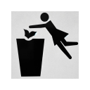

# Tóth Gabi Content Blocker 1.4.3 

Ez a Chrome kiegészítő eltávolítja a Tóth Gabihoz kapcsolódó tartalmakat a magyar (.hu) weboldalakról, biztosítva egy Tóth Gabi-mentes böngészési élményt.

## Funkciók
- **Tartalom Szűrés**: Automatikusan eltávolít minden Tóth Gabihoz kapcsolódó tartalmat a .hu domainnel rendelkező oldalakról.
- **Egyszerű Kezelés**: A kiegészítő állapota egyszerűen szabályozható egy ki- bekapcsoló gombbal.
- **Könnyű Telepítés**: Egyszerű telepítés és azonnali működés.

## Telepítés
0. Innen [chrome web store](https://chromewebstore.google.com/detail/t%C3%B3th-gabi-content-blocker/poaoipkelchclhhjlemjepcghhkcnfma?hl=hu&fbclid=IwAR2ZGioHstjSuUGwd6cTO-IuxadPI0C8sIjzTeKddI2gTRqxfvdFIFB0nNY)
1. Vagy...
2. Töltse le a forrást egy mappába
3. Írja be a böngészősorba [chrome://extensions/](chrome://extensions/)
4. Kapcsolja be a fejlesztő módot, jobb felül.
5. Kicsomagolt elemek betöltése gombbal válassza ki a mappát.
6. Kapcsolja be a kiegészítőt.

   
## Használat
A kiegészítő ikonja megjelenik a Chrome eszköztárán. Kattintson rá a bekapcsoló gomb eléréséhez, ahol ki- és bekapcsolhatja a kiegészítő működését.

## Súgó és Támogatás
A szűrő logikáját a [content.js](content.js) tartalmazza.
A tartalmi változásokat a [MutationObserver](https://developer.mozilla.org/en-US/docs/Web/API/MutationObserver) figyeli.

## Fejlesztői információk

- **Verzió**: 1.4.3
- **Fejlesztő**: [Petke](https://github.com/tajtipeter71)
- **Licenc**: [MIT](LICENSE)
- **[Fejlesztőknek: chrome-react-extension-tothgabi](https://github.com/tajtipeter71/chrome-react-extension-tothgabi)**
© [Petke](https://github.com/tajtipeter71), [2024]. Minden jog fenntartva.
